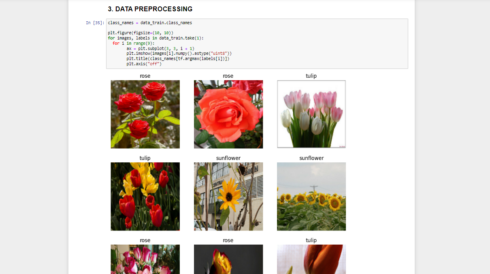
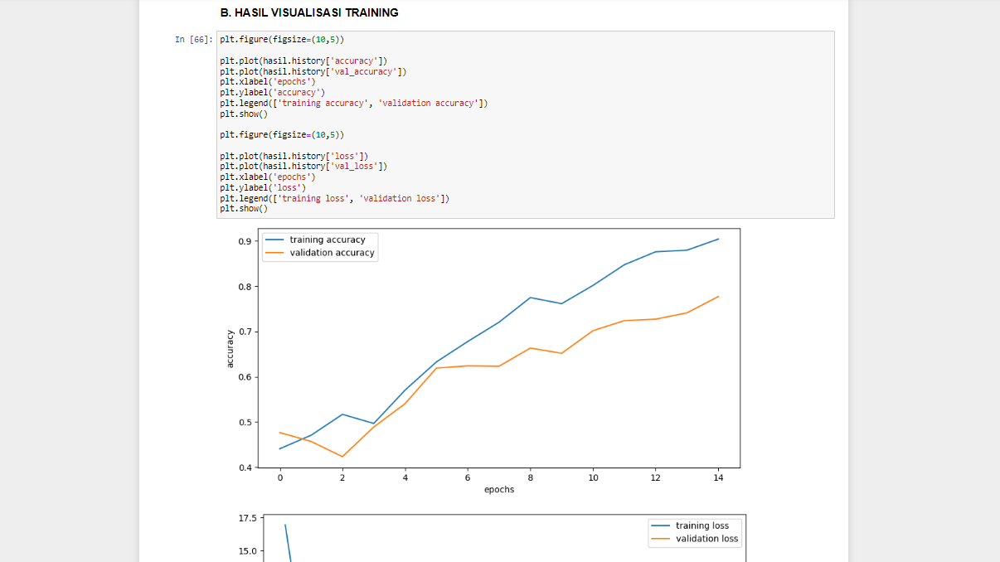

<!-- README Referensi: https://github.com/othneildrew/Best-README-Template/ -->

<!-- https://www.markdownguide.org/basic-syntax/#reference-style-links-->

<h3>PROJECT AKHIR PRATIKUM KECERDASAN BUATAN</h3>

  <a href="https://github.com/Natalieefd/PA-PRATIKUM-KB.git"><strong>Go To Project  »</strong></a>  

<h2>KELOMPOK 5 A2'21</h2>
<ul>
  <h3>Anggota Kelompok</h3>
  <li>Natalie Fuad (2109106040) - <strong>Ketua Kelompok</strong>
  <li>Agustina Dwi Maharani (2109106037)
  <li>Sherina Laraswati (2109106050)
</ul> 

<h2>JOB DESK</h2> 
<ul>
  <li>Collecting (<strong>Agustina Dwi Maharani</strong>)
  <li>Data Preprocessing (<strong>Natalie Fuad</strong>)
  <li>Data Analisis dan Visualisasi (<strong>Natalie Fuad</strong>)
  <li>Data Modeling (<strong>Agustina Dwi Maharani</strong>) 
  <li>Evaluasi dan Save Modeling (<strong>Sherina Laraswati</strong>)
</ul> 

<h2>PROJECT</h2>
<strong>Flowers Recognition</strong>  

<strong>Project Description</strong> 
Projek akhir ini membahas mengenai model kecerdasan buatan dalam mendeteksi jenis bunga. 

<strong>Dataset Description</strong> 
Kumpulan data yang berisikan gambar jenis bunga, yaitu tulip, rose dan sunflower. Data citra tersebut kemudian dibagi menjadi 3 kelas berdasarkan kondisinya, yaitu  tulip, rose dan sunflower ke dalam folder yang terpisah, yakni train dan test dengan perbandingan 7:3. Setiap kelasnya memiliki jumlah gambar yang bereda-beda, untuk rose : 1510 gambar, sunflower : 1366, dan tulip : 1975 gambar sehingga total keseluruhan sebanyak 4851 gambar. Tiap-tiap gambar berukuran 150 x 150pixel dengan penggunaan warna RGB.

<h5>Link Dataset: https://www.kaggle.com/datasets/alxmamaev/flowers-recognition</h5>
<h5>link sumber dataset   : https://www.kaggle.com/datasets/alxmamaev/flowers-recognition/code</h5> 

<strong>Project Preview</strong>  

  

[<a href="#top">Back to top</a>]

